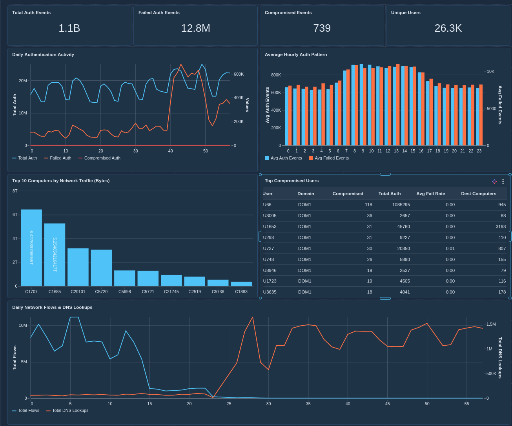

# LANL Cybersecurity Events — Databricks ETL

A medallion-architecture ETL pipeline on Databricks that ingests, cleans, and enriches the **LANL Comprehensive, Multi-Source Cyber-Security Events** dataset for downstream analytics and ML.

> **Source:** Los Alamos National Laboratory — [doi:10.17021/1179829](http://dx.doi.org/10.17021/1179829)  
> **Coverage:** 58 consecutive days · 1.65 B events · 12,425 users · 17,684 computers · 62,974 processes  
> **Dataset License:** CC0

---

## Project Structure

```
LANL-Databricks-ETL/
├── etl/
│   ├── lanl_etl_bronze   # Ingest raw CSVs → Bronze Delta tables
│   ├── lanl_etl_silver   # Clean & enrich Bronze → Silver Delta tables
│   └── lanl_etl_gold     # Aggregate Silver → Gold analytics & ML tables
├── eda/                   # Exploratory data analysis (placeholder)
├── dashboard-screenshot.png
├── LICENSE                # Apache 2.0
└── README.md
```

---

## Architecture

```
  Volume (raw CSVs)        Bronze (workspace.bronze_lanl)     Silver (workspace.silver_lanl)     Gold (workspace.gold_lanl)
 ────────────────── ───►  ──────────────────────────────  ───► ──────────────────────────────  ───► ──────────────────────────────
  auth.txt   (~73 GB)      auth        (1,051,430,459)         auth                                user_daily_auth_summary
  dns.txt    (~813 MB)     dns            (40,821,591)         dns                                 computer_daily_network_profile
  flows.txt  (~5.2 GB)    flows         (129,977,412)         flows                               hourly_security_dashboard
  proc.txt   (~15 GB)     proc          (426,045,096)         proc                                user_process_baseline
  redteam.txt (~23 KB)    redteam              (749)           redteam                             ml_user_day_features
                                                               auth_labeled
```

Source files are stored in the Unity Catalog Volume at `/Volumes/workspace/default/lanl`.

---

## Bronze Layer (`etl/lanl_etl_bronze`)

Reads raw comma-separated text files and writes them as-is into Delta tables under `workspace.bronze_lanl`, adding `_ingested_at` and `_source_file` audit columns.

| Table | Source File | Key Columns |
|-------|-----------|-------------|
| `auth` | auth.txt | time, source_user, destination_user, source/dest computer, auth_type, logon_type, success_failure |
| `dns` | dns.txt | time, source_computer, resolved_computer |
| `flows` | flows.txt | time, duration, source/dest computer+port, protocol, packet_count, byte_count |
| `proc` | proc.txt | time, user, computer, process_name, start_end |
| `redteam` | redteam.txt | time, user, source_computer, destination_computer |

---

## Silver Layer (`etl/lanl_etl_silver`)

Applies the following transforms on top of the bronze tables and writes to `workspace.silver_lanl`:

| Table | Transforms |
|-------|-----------|
| `auth` | Parse `user@domain` into separate user + domain columns; replace `?` with NULL; add `is_failed` flag; add `time_day` / `time_hour` buckets |
| `dns` | Replace `?` with NULL; add time buckets |
| `flows` | Replace `?` with NULL; classify well-known destination ports into `service_type` (HTTP, SSH, RDP, Kerberos, etc.); add time buckets |
| `proc` | Parse `user@domain`; replace `?` with NULL; convert `start_end` to `is_start` boolean; add time buckets |
| `redteam` | Parse `user@domain`; add time buckets |
| `auth_labeled` | Left-join silver `auth` with `redteam` on (time, source_user, source_computer, destination_computer) → `is_compromised` boolean flag for ML |

> **Note:** `auth_labeled` contains 37 more rows than `auth` (1,051,430,496 vs 1,051,430,459) due to a small many-to-one fan-out where multiple redteam entries share identical join keys.

---

## Gold Layer (`etl/lanl_etl_gold`)

Aggregates silver tables into business-level analytics and ML-ready tables under `workspace.gold_lanl`:

| Table | Description |
|-------|-----------|
| `user_daily_auth_summary` | Per-user, per-day authentication metrics: total/failed events, fail rate, distinct destinations, auth/logon type diversity, compromised event count |
| `computer_daily_network_profile` | Per-computer, per-day network activity: flow counts, total bytes/packets, avg duration, service diversity, DNS lookup counts (full outer join of flows + DNS) |
| `hourly_security_dashboard` | Hourly threat-surface rollup: total/failed/compromised auth counts, unique users and computers — designed for dashboarding |
| `user_process_baseline` | Per-user, per-day process behavior: total events, starts vs stops, distinct process names and computers |
| `ml_user_day_features` | Wide feature table joining auth + process gold tables per user-day with `is_compromised` label for ML training |

---

## Dashboard

An interactive Cybersecurity Operations Dashboard built on the gold tables provides a real-time security operations view:

* **KPI counters** — total auth events (1.05B), failed auths (12.8M), compromised events (739), unique users (26.3K)
* **Daily auth activity** — dual-axis trend of total, failed, and compromised authentications over 58 days
* **Hourly auth pattern** — average workday peaks between hours 8–15
* **Top 10 computers by network traffic** — ranked by total bytes transferred
* **Top compromised users** — red team targets with auth metrics and fail rates
* **Daily network volume** — flows and DNS lookups revealing a sensor infrastructure change around day 23



---

## Getting Started

### Prerequisites

* Databricks workspace with Unity Catalog enabled
* Raw LANL data files uploaded to `/Volumes/workspace/default/lanl`

### Running the Pipeline

1. **Bronze** — Open and run all cells in `etl/lanl_etl_bronze`
2. **Silver** — Open and run all cells in `etl/lanl_etl_silver`
3. **Gold** — Open and run all cells in `etl/lanl_etl_gold`

Each notebook is idempotent (`mode("overwrite")`), so re-runs replace existing tables.

---

## Citation

> A. D. Kent, *Cybersecurity Data Sources for Dynamic Network Research*,
> in *Dynamic Networks in Cybersecurity*, 2015.

---

## License

This project is licensed under the **Apache License 2.0** — see [LICENSE](LICENSE) for details.  
The underlying LANL dataset is released under **CC0**.
